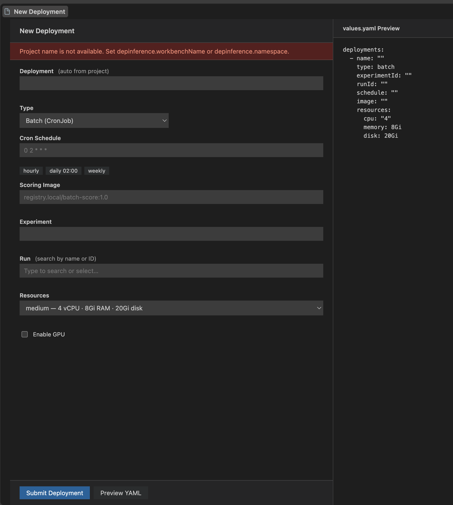

# DepInference — Deploy & Inference Playground

OpenShift AI workbench veya code-server üzerinde çalışan VS Code extension'ı. Data scientist'in MLflow'taki bir run'ı seçerek GitOps repository'sine online (KServe InferenceService) veya batch (CronJob) deployment PR'ı açmasını ve hazır olduğunda inference testi yapmasını sağlar.

## Arayüz



Form dummy data modunda açıldığında deployment adı, experiment, run, resource preset'i ve batch image değerleri otomatik doldurulur. GPU açıldığında `1g.20`, `2g.20` ve `4g.40` MIG profilleri seçilebilir.

## Nasıl çalışır?

1. **Proje ve experiment çözümü**
   - Workbench adı `depinference.workbenchName` ayarından veya `WORKBENCH_NAME` env değerinden alınır.
   - Proje adı `"-".join(workbench_adı.split("-")[:-1])` formülüyle türetilir.
   - Bu proje adı aynı zamanda namespace ve MLflow experiment adı olarak kullanılır.
   - Ayar/env yoksa `depinference.namespace` veya Kubernetes namespace değerleri fallback olarak kullanılır.

2. **Run seçimi**
   - Extension, proje adıyla eşleşen MLflow experiment'ini `experiments/get-by-name` ile bulur.
   - Bu experiment'teki run'lar aranabilir combobox'ta listelenir; en yeni run varsayılan seçilir.

3. **Form ve validasyon**
   - Online: yalnızca experiment/run ve resource seçimi.
   - Batch: ek olarak cron schedule ve scoring image.
   - Resource preset'leri CPU/memory/disk değerlerini belirler.
   - GPU açılırsa MIG profili deployment kaydına eklenir.

4. **GitOps PR akışı**
   - Extension, Azure DevOps repository'sinden `values.yaml` dosyasını çeker.
   - `deployments:` listesinde aynı isimdeki kaydı günceller veya yeni kayıt ekler.
   - `deploy/<proje-adı>` branch'ine commit/push yapar.
   - PAT tanımlıysa PR'ı otomatik açar; tanımlı değilse önceden doldurulmuş PR oluşturma sayfasını tarayıcıda açar.

5. **Cluster durumu ve playground**
   - Extension, workbench service account token'ı ile KServe InferenceService durumunu poll eder.
   - Deployments ağacında `Pending`, `Ready`, `Failed` durumu gösterilir.
   - Online deployment `Ready` olduğunda Playground paneli predictor endpoint'ine `POST /v1/models/<name>:predict` isteği atabilir.

## Kurulum ve geliştirme

```bash
npm install
npm run compile
npm test
npm run package
```

VSIX dosyası `depinference-openshift-ai-0.1.0.vsix` olarak üretilir.

Hazır AMD64 paketi: `artifacts/depinference-openshift-ai-amd64.vsix`.

## Önemli ayarlar

| Ayar | Açıklama |
| --- | --- |
| `depinference.azure.repoUrl` | Azure DevOps repository URL'si |
| `depinference.azure.valuesPath` | Güncellenen Helm `values.yaml` yolu |
| `depinference.azure.targetBranch` | PR hedef branch'i |
| `depinference.workbenchName` | Proje/experiment adını türetmek için workbench adı |
| `depinference.namespace` | OpenShift proje/namespace fallback değeri |
| `depinference.resourcePresets` | CPU/memory/disk preset override'ları |
| `depinference.imageCatalog` | Batch scoring image önerileri |
| `depinference.useDummyData` | Azure/MLflow/cluster erişimi olmadan form ve akışı demo etmek |

## values.yaml sözleşmesi

```yaml
deployments:
  - name: demo-project
    type: online
    experimentId: "101"
    runId: "dummy-run-a-101"
    resources:
      cpu: "4"
      memory: "8Gi"
      disk: "20Gi"
      gpu: 1g.20   # yalnızca GPU açıkken
```
